# mdmpatcher-linux-on-windows-guide
This is a guide that uses MDMPatcher-Linux created by Gudui on a linux virtual machine, to achieve bypassing MDM on Windows computer.
# How to bypass Apple MDM in Windows/Linux Step-by-Step

> **Shoutout & Disclaimer:** Huge credit to **Gudui** for creating [MDMPatcher-Linux](https://github.com/Gudui/MDMPatcher-Linux) and **fled_dev** for the [MDMPatcher-Enhanced](https://github.com/fled-dev/MDMPatcher-Enhanced) contributors for the templates! This guide is just a workaround to make their tools work for Windows users. 
> 
> *Note: This is for educational use and recovering your own hardware. It requires a full device wipe, so backup your photos first (but don't use standard Apple backups, or the MDM profile will come right back!). Use at your own risk.*
# Intro
This tutorial guides on using MDMPatcher-Linux in Windows, for bypassing Apple MDM step by step.

<b>Please note that this guide requires resetting the iPhone/iPad to bypass MDM.</b>

<b>Please skip to MDMPatcher-Linux if you are using Linux.</b>

My approach is by using a VMware, and deploy a linux machine to use the MDMPatcher (Since I don't know how to rewrite the code to adapt Windows)

This guide works for devices that have ADE, where MDM restores once your restored device is connected to WiFi.
This should be completely free to achieve.

This guide may be lengthy, feel free to skip if you already know!

# Download VM Workstation Pro for Windows
Skip to MDMPatcher for Linux if you are using Linux or you have linux machine installed(I don't know if you are using VMware or other ways)

Go to [support.broadcom.com](support.broadcom.com).
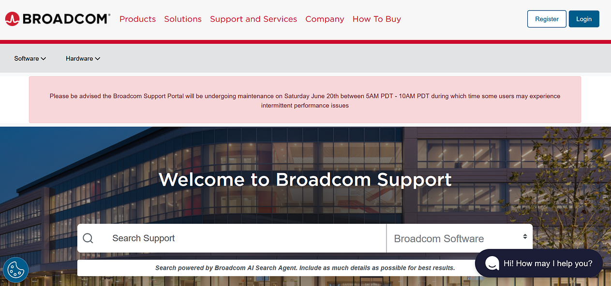
Register an account(If you don't have one)

Login to the page
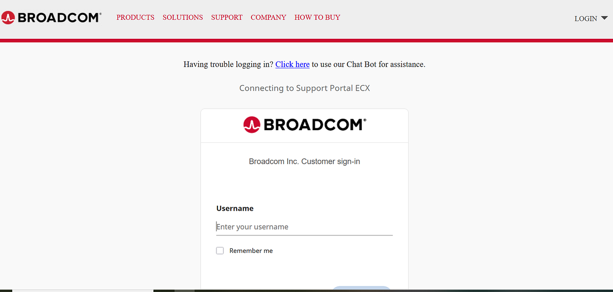
Go to [support.broadcom.com/group/ecx/free-downloads](support.broadcom.com/group/ecx/free-downloads) or click the icon,
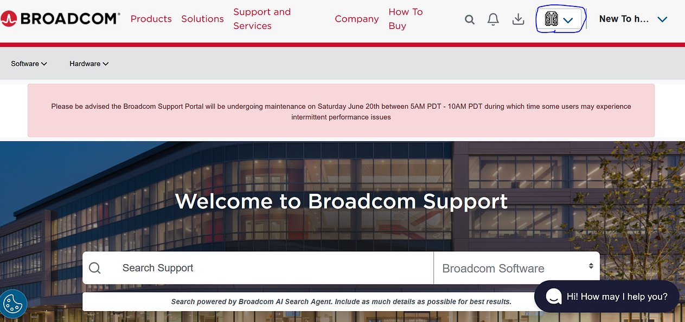

Choose Mainframe software,
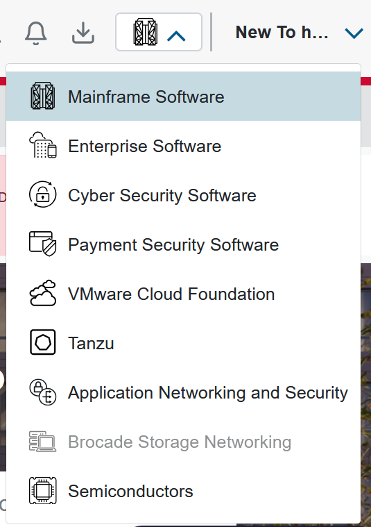
Go to downloads.
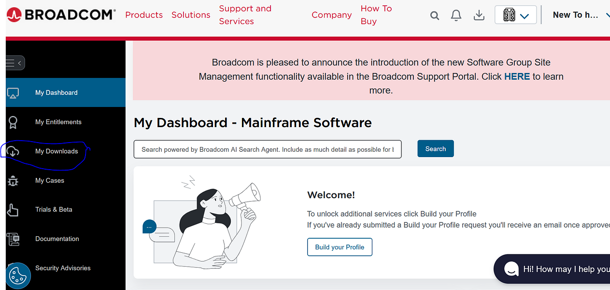
Click "HERE"
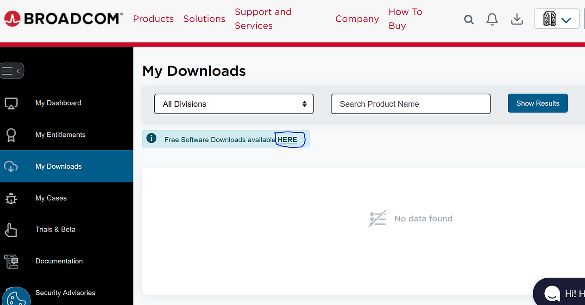
Go to VMware Workstation Pro,
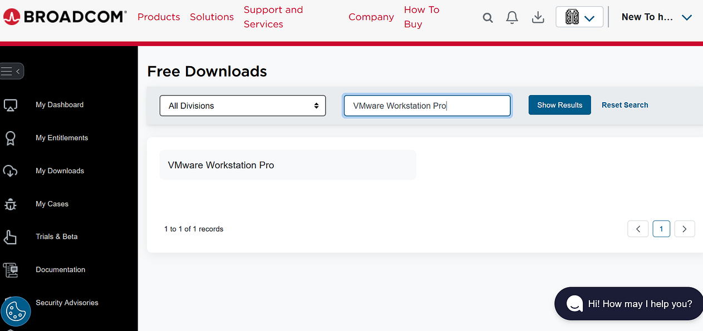
Click the latest version for Windows( You can go for stable version(xx.x) if you want)
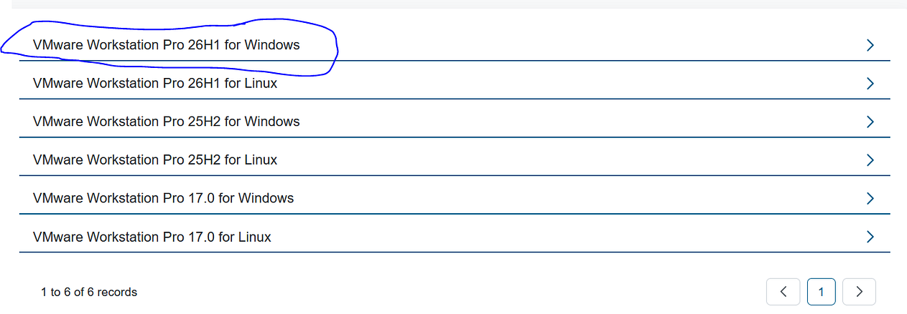
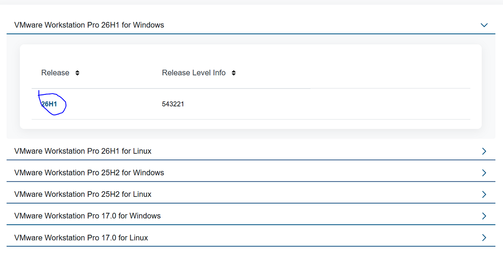
Click into terms and conditions, and go back to the ProductFiles page, click agree. (If you don't click into Terms and conditions, it won't let you agree)

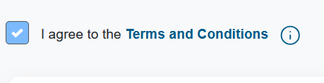

Scroll to the right, and click the download button.

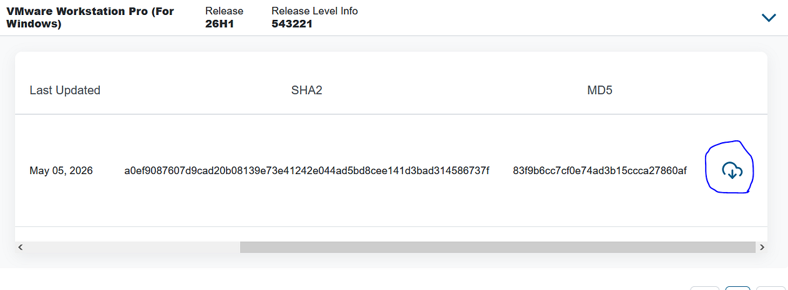

It should download the .exe file.

Open the .exe file, follow the instructions, and you have VM workstation ready!

# Deploy Linux machine
In this guide, I'll use ubuntu for the linux machine.

Download the ubuntu image file(.iso) on the [official webpage](https://ubuntu.com/download/desktop)
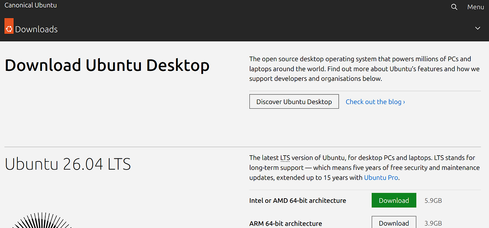

Download the architecture that fits your CPU(Usually AMD 64-bit, unless you are using mobile cpu or Apple CPU. If you have a Mac, then you don't need this guide)

Open VMware
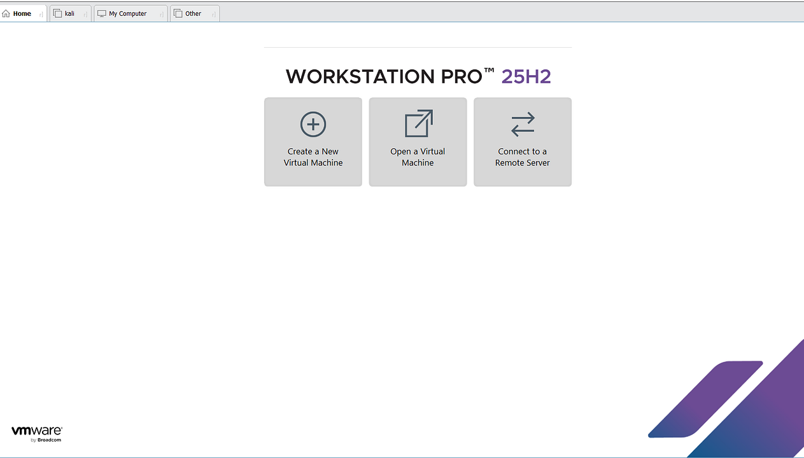

Create the ubuntu virtual machine ( The VMware I use is 25h2, because I did not update my VMware version)
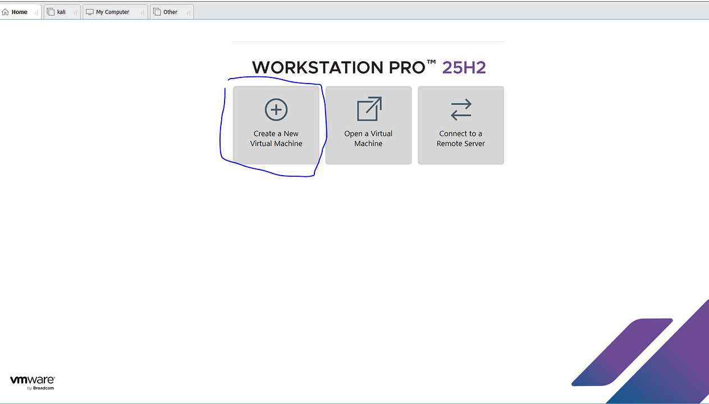

Typical configuration is fine, and use "Installer disc image file" for the machine.
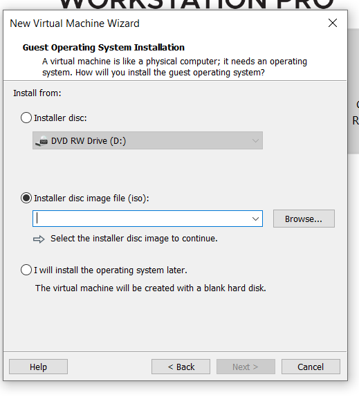

Paste the address of the downloaded iso file or Use browse to click out the iso file address.
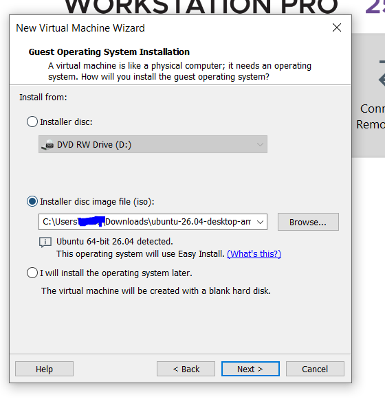

Input everything it has asked you to input on your own. Just in case, remember the username and password, as this account is for system.

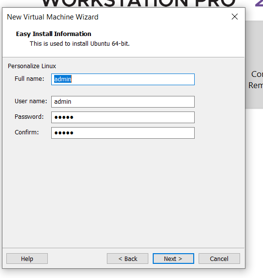

Next, and allocate the disk size for the machine. The recommended size(20GB) will be fine for now.
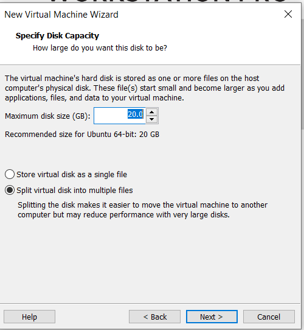

Finish, and your ubuntu machine should automatically start!
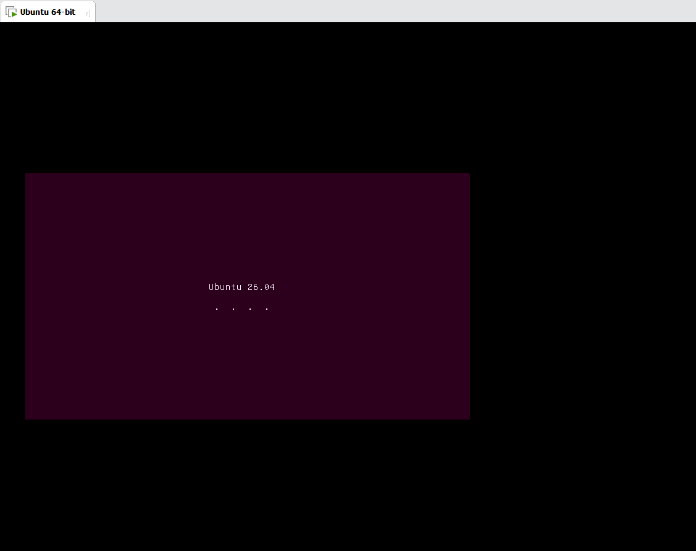

It will take few minutes to initialize, and the set up page will pop up.
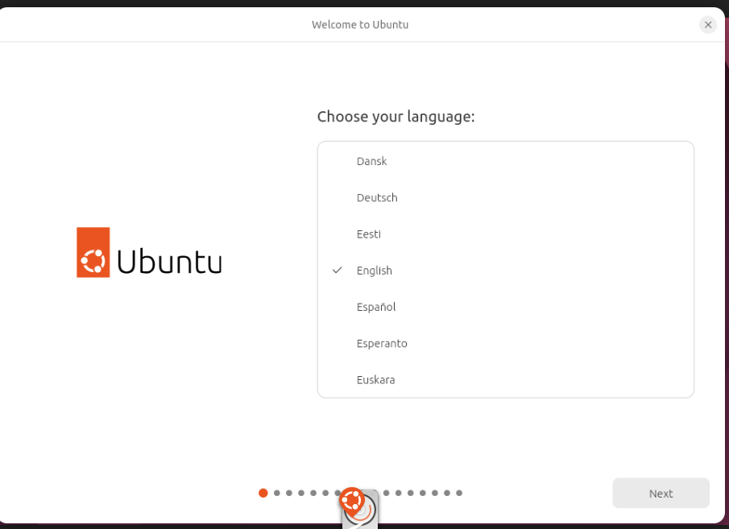

Just follow the set up page's instruction, and choose the erase disk and install ubuntu. This will get the work easier.

Of course, remember the username and password when you create account for login!

Wait for a long while… Perhaps take a sip of tea..

Finally!
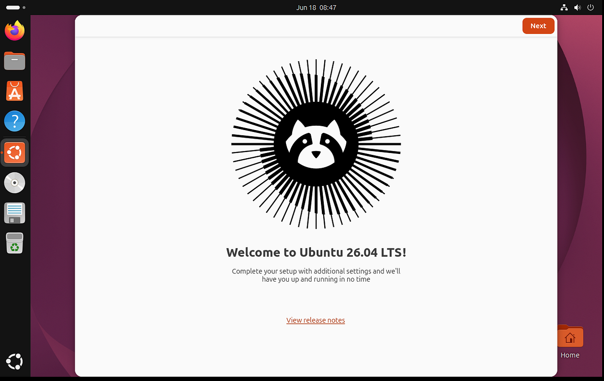

That took an hour for me, but we have linux VM ready!

Just configure the setup as you like, and the deployment is finished.

If you find that copy paste between host machine and VM does not work,

run these commands:
```bash
sudo apt-get autoremove open-vm-tools -y
sudo apt-get install open-vm-tools-desktop -y
```
Then, restart the machine. Copy and paste should work now.

# Set up MDMPatcher-Linux
Most of the guides are copied from the instruction given by the [Gudui/MDMPatcher-Linux](https://github.com/Gudui/MDMPatcher-Linux.git), and some personal addition that solves the obstacles I faced.

Open terminal in the Apps.
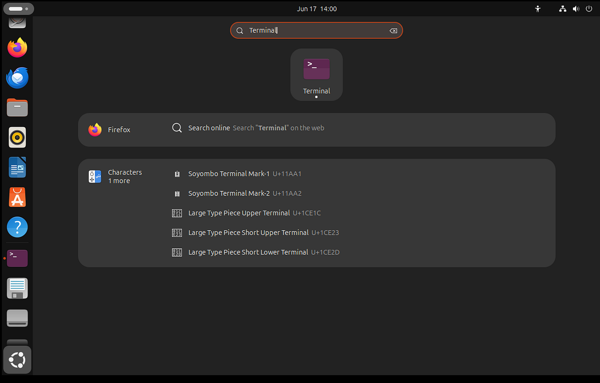

Let's create a folder that stores the programs.
```bash
mkdir MDMPatch
cd MDMPatch
```
## Install System Dependencies
Run the commands:
```bash
sudo apt update
sudo apt install -y \
    build-essential \
    pkg-config \
    git \
    autoconf \
    automake \
    libtool \
    libssl-dev \
    libzip-dev \
    libreadline-dev \
    libusb-1.0-0-dev \
    usbmuxd
```
## Build libimobiledevice Stack
```bash
# Create a build directory
mkdir -p ~/mdm-build && cd ~/mdm-build

# 1. libplist
git clone https://github.com/libimobiledevice/libplist.git
cd libplist
./autogen.sh
make
sudo make install
cd ..

# 2. libimobiledevice-glue
git clone https://github.com/libimobiledevice/libimobiledevice-glue.git
cd libimobiledevice-glue
./autogen.sh
make
sudo make install
cd ..

# 3. libusbmuxd
git clone https://github.com/libimobiledevice/libusbmuxd.git
cd libusbmuxd
./autogen.sh
make
sudo make install
cd ..

# Personal addition
# Libtatsu requires libcurl
sudo apt install libcurl4-openssl-dev -y

# When I run the libimobiledevice, it says libtatsu not found
# These lines install the libtatsu
git clone https://github.com/libimobiledevice/libtatsu.git
cd libtatsu
./autogen.sh
make
sudo make install
cd ..

# 4. libimobiledevice
git clone https://github.com/libimobiledevice/libimobiledevice.git
cd libimobiledevice
./autogen.sh
make
sudo make install
cd ..

# Personal addition
# The MDMPatcher requires libirecovery
git clone https://github.com/libimobiledevice/libirecovery.git
cd libirecovery
./autogen.sh
make
sudo make install
cd ..

# Update library cache
sudo ldconfig
```
## Verify Installation
```bash
# Check if libraries are found
pkg-config --modversion libimobiledevice-1.0
pkg-config --modversion libplist-2.0
pkg-config --libs openssl libzip
```
This should look something like this:
```markdown
1.4.0–9-gfa0f791
2.7.0–66-g32428ab
-lssl -lcrypto -lzipld
```
Instead of:
```markdown
Package 'libimobiledevice-1.0' not found
````
Now, we test connection with computer. Remember staying at the VMware page, and plug in the device with the cable.

The VMware should pop out a window like this:
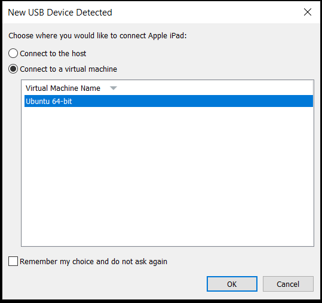
Remember click the "Connect to a virtual machine", and select the ubuntu or your Linux VM!

Then, let's test the connection.
Run command:
```bash
idevice_id -l
```
It should give out a long string of numbers and alphabet(UDID), instead of
```markdown
ERROR: Unable to retrieve device list!
```
Then, we have device connected!

However, we need to reset the device first.

## Restore device for Windows

Download iTunes(if you are windows 10) from official website or download apple device manager(if you are windows 11) from Microsoft store.

I personally like to download iTunes from Apple website than download it via Microsoft store(I'm using windows 10).
Open iTunes, and connect your device to host machine.
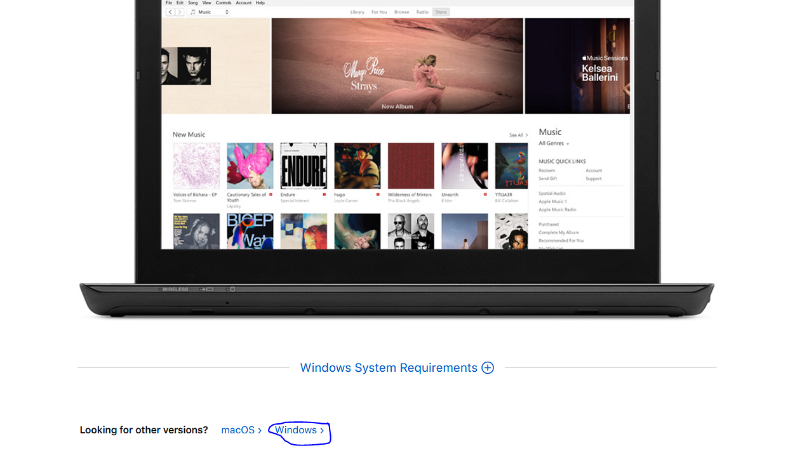
If you cannot find your device, it might be directed to VM
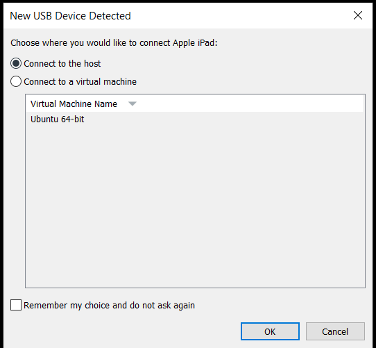
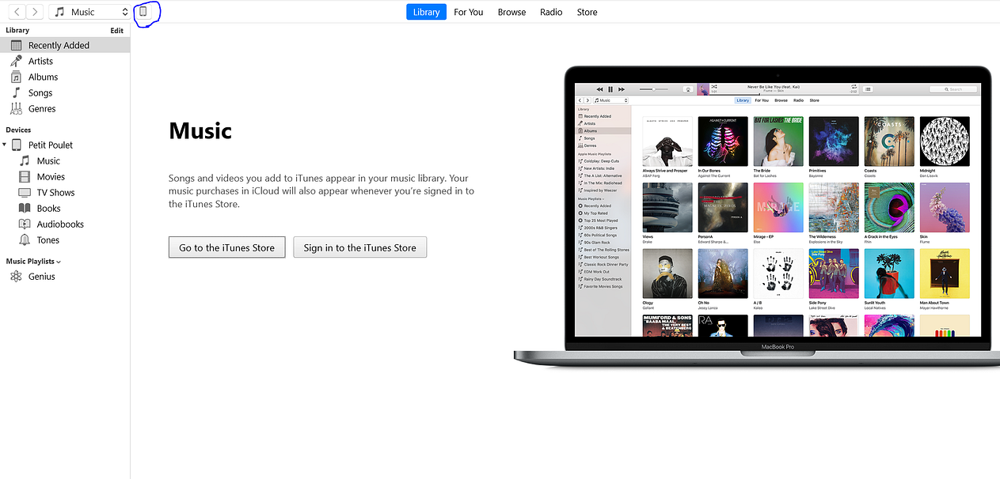
Switch back to host machine

Click "Restore".
>After this step, data in your device will be erased! Remember to back up photos or important data on your own. The Apple backup cannot work here because it brings MDM back onto your device, so you can try transfer the data to your personal computer or drives, or iCloud.

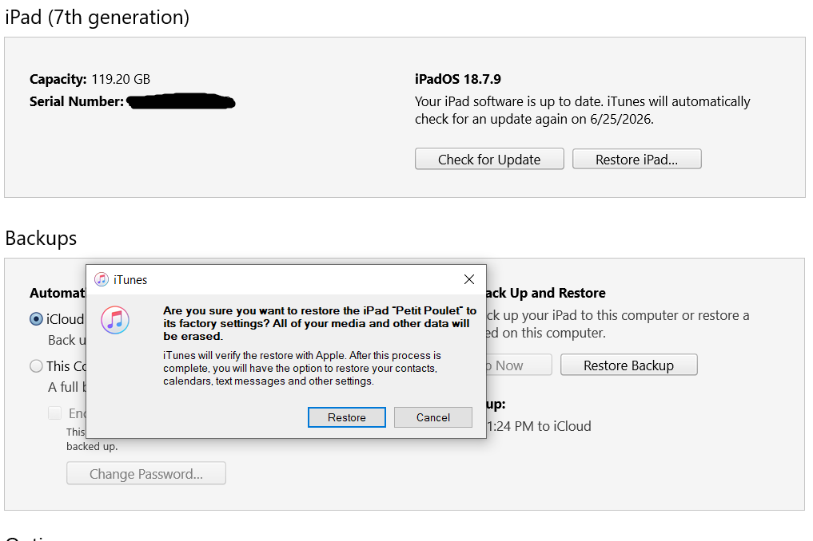


## Restore device for Linux
If you are using Linux, we will use the idevicerestore from libimobiledevice.
First, connect your device to computer, and select trust the computer in your device.
Then, run the following command:
```bash
sudo apt update
sudo apt install idevicerestore -y
idevicerestore -e
```
After this step, data in your device will be erased! Remember to back up photos or important data on your own. The Apple backup cannot work here because it brings MDM back onto your device, so you can try transfer the data to your personal computer or drives, or iCloud.

Now, your device should be at the setup page. Do not connect to WiFi when your device is at setup page, or else you might need to restore the device again.

Go back to VMware(If you are using VMware):

Since your device is connected to host machine, you can click this at the bottom right of the VMware interface on your machine tab, to connect the device to the VM.
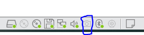
## Prepare Required Files
We have 3 files to download from the original MDMPatcher-Enhanced:
```markdown
extension1.pdf - Info.plist template (encrypted)
extension2.pdf - Manifest.plist template (encrypted)
libiMobileeDevice.dylib - Backup structure archive (encrypted)
```
You can grab the files on the website, or run the command:

First, make sure you are in the MDMPatcher directory!
```bash
wget https://raw.githubusercontent.com/fled-dev/MDMPatcher-Enhanced/main/MDMPatcher/extension1.pdf
wget https://raw.githubusercontent.com/fled-dev/MDMPatcher-Enhanced/main/MDMPatcher/extension2.pdf
wget https://raw.githubusercontent.com/fled-dev/MDMPatcher-Enhanced/main/MDMPatcher/libiMobileeDevice.dylib
```
The terminal should be at ~/MDMPatch(Or the directory where your MDMPatch folder is at)

## Compile MDM Patcher
Make sure your terminal is opened in MDMPatcher folder!
```bash
# Clone or download the source code
# I replaced the <your-repo-url> in the instruction, should be working
git clone https://github.com/Gudui/MDMPatcher-Linux.git
# Move the three files into the folder

mv extension1.pdf extension2.pdf libiMobileeDevice.dylib MDMPatcher-Linux
# go to the directory downloaded, which is stated mampatcher in original guide
cd MDMPatcher-Linux

# Compile
gcc -o mdm_patch \
    main.c \
    patch_logic.c \
    idevicebackup2.c \
    libidevicefunctions.c \
    utils.c \
    -I. \
    -D_GNU_SOURCE \
    $(pkg-config --cflags --libs libimobiledevice-1.0 libimobiledevice-glue-1.0 libplist-2.0 openssl libzip) \
    -lreadline -lm

# Make executable
chmod +x mdm_patch
```
You now have the MDM patcher set up! Then, it's time to really use it.
# Use MDMPatcher
## Prerequisites( From Gudui/MDMPatcher-Linux readme.md)
```markdown
Restore your device to factory settings using iTunes/Finder or idevicerestore
<b>Do NOT complete the setup wizard</b> - stop at the WiFi selection screen
<b>Do NOT connect to WiFi</b> - this prevents MDM re-enrollment
Connect device via USB
Trust the computer when prompted on device
```
Your device should be connected to the virtual machine, or the linux system.
Running the Patcher
```bash
# Ensure required files are in the current directory
ls extension1.pdf extension2.pdf libiMobileeDevice.dylib

# Run the patcher
./mdm_patch
```
And you've done it! The MDM is bypassed. However, if you reset the device, the MDM will come back, and you'll need to rerun the patcher.

